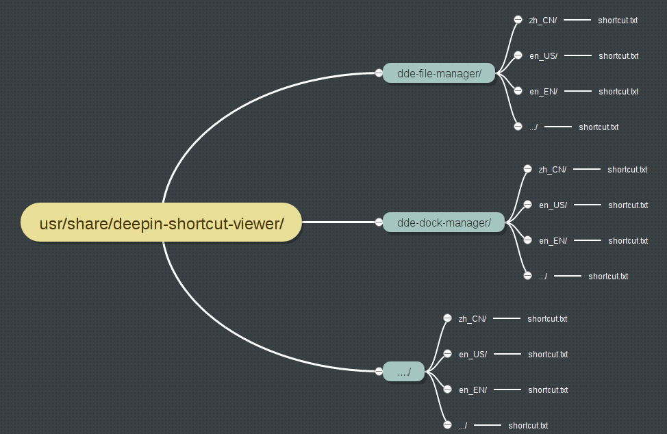
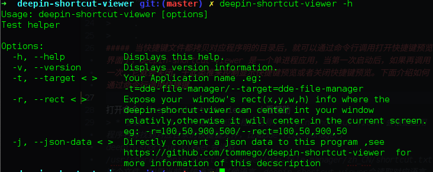
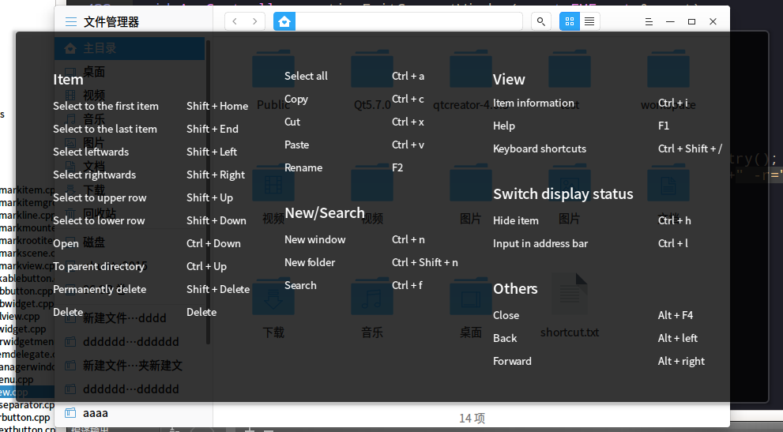

## deepin-shortcut-viewer 使用说明文档

源码地址：https://tommego@cr.deepin.io/a/deepin-shortcut-viewer
#### 1. 快捷键文档目录位置:usr/share/deepin-shortcut-viewer
>  * 快捷键目录结构：
 >              
>  * 每个应用程序可以在这个目录创建自己的快捷键文档，拿文件管理器为例：文件管理器的应用明是 dde-file-manager，拿文件管理器可以在这里创建目录：usr/share/deepin-shortcut-viewer/dde-file-manager。然后把快捷键文件拷进这个目录。
>  * 由于快捷键文档要支持多语言，所以需要把翻译好的shortcut文档拷进对应语言目录中，比如中文：~/deepin-shortcut-viewer/dde-file-manager/zh_CN/shortcut.txt；英文：~/deepin-shortcut-viewer/dde-file-manager/en_US/shortcut.txt，等等。
#### 2. 快捷键文档格式：shortcut.txt
>     [分类1]                                
>     标题1=快捷键符                       
>     标题2=快捷键符                
>     标题3=快捷键符                
>     .
>     .
>     .
>     [分类2]
>     标题1=快捷键符
>     标题2=快捷键符
>     .
>     .
>     . 
##### 当快捷键文件都拷贝对应程序明的目录后，就可以通过命令行调用打开快捷键预览界面了，deepin-shortcut-viewer 是一个单进程应用，当第一次启动后，如果再调用一次，它就会关闭。于此类推来控制显示快捷键预览或者关闭快捷键预览。下面介绍如何通过命令行调用快捷键。

打开命令：deepin-shortcut-viewer -h看帮助
> * 参数 -t,--target是指向应用程序名称，deepin-shortcut-viewer会根据应用程序名称找到对应目录的快捷键文件，比如dde-file-manager，deepin-shortcut-viewer会读取/usr/share/deepin-shortcut-viewer/dde-file-manager/zh_CN/shortcut.txt这个文件，如果当前系统语言是其他语言，deepin-shortcut-viewer会读取对应语言目录的shortcut.txt文件，比如../en_US/shortcut.txt。
> * 参数-r,--rect是用来暴露你当前程序窗口的位置信息，当加上这个参数暴露当前要居中的窗口坐标信息的时候，deepin-shortcut-viewer会居中到这个窗口，如果不加这个参数，deepin-shortcut-viewer会居中到屏幕。

命令行打开命令事例：
>        deepin-shortcut-viewer -t=dde-file-manager -r=200,200,700,450
>  应用截图：
>  
